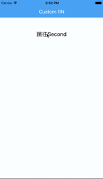
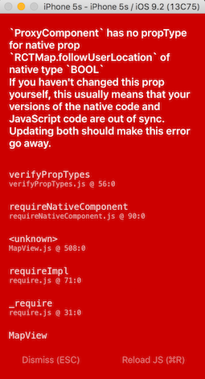
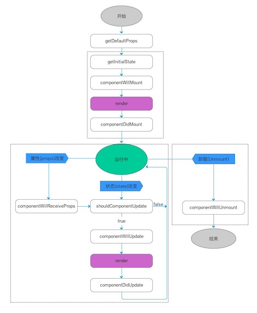

#React Native中的页面跳转

页面跳转是手机App开发中很重要的一环，React Native中的页面跳转离不开Navigator。

我们先看看最终效果



### 一、准备工作
关于怎么搭建RN开发环境，参考[React Native中文网](http://reactnative.cn/docs/0.27/getting-started.html#content)，这里直接从代码开始。所有相关代码都在oschina的代码仓库[LearnRN](http://git.oschina.net/idiotwind/LearnRN)中，可根据commit记录逐步还原。

初始化之后，你需要修改的代码就在index.android.js和index.ios.js中。既然RN最大的魅力就在于一套代码，多处运行，所以我们第一步先把让Android和iOS的代码都指向同一个地方。

1. 新建src文件夹，并在src中创建app.js
2. 将index.ios.js的代码复制到app.js中
3. 将index.android.js和index.ios.js中的代码改为相同的一行代码require ('./src/app')

具体可以参考[commit c548b](http://git.oschina.net/idiotwind/LearnRN/tree/c548bb720c81e05ae4e591ae5453b6cf03ccba93/)
PS. 最近初始化项目的时候会遇到类似如下图片的out of sync问题
解决方法只需要简单4步

1. 删除工程目录下的node_modules
2. 在工程根目录下运行npm install
3. 运行npm start -- -- reset-cache
4. 再执行react-native run-ios就能正常运行了。



### 二、引入Navigator
关于Navigator的相关代码可以参考[commit b62edc](http://git.oschina.net/idiotwind/LearnRN/tree/b62edce8fdf3e8a61795b5aede3b1ad53b6f43d5/)。以下为主要的代码片段：

```javascript
import Main from './Main.js';
var nav;
const defaultRoute = {
  component: Main,
  title: 'Custom RN',
};

class LearnRN extends Component {
    _renderScene(route, navigator) {
    let Component = route.component;
    nav = navigator;
    return (
      <Component {...route.params} navigator={navigator} />
    );
  }

  _renderNavBar() {
    var routeMapper = {
      LeftButton(route, navigator, index, navState) {
        if(index > 0) {
          return (
            <TouchableOpacity 
              onPress={() => navigator.pop()}
              style={styles.button}>
              <Text style={styles.buttonText}>Back</Text>
            </TouchableOpacity>
          );
        } else {
          return null;
        }
      },
      RightButton(route, navigator, index, navState) {
        if(index > 0 && route.rightButton) {
          return (
            <TouchableOpacity 
              onPress={() => navigator.pop()}
              style={styles.button}>
              <Text style={styles.buttonText}></Text>
            </TouchableOpacity>
          );
        } else {
          return null;
        }

      },
      Title(route, navigator, index, navState) {
        return (
          <View style={styles.title}>
            <Text style={styles.buttonText}>{route.title ? route.title : 'Default Title'}</Text>
          </View>
        );
      }
    };

    return (
      <Navigator.NavigationBar
        style={{
          alignItems: 'center',
          backgroundColor: '#55ACEE',
          shadowOffset:{
              width: 1,
              height: 0.5,
          },
          shadowColor: '#55ACEE',
          shadowOpacity: 0.8,          
          }}
        routeMapper={routeMapper} />
    );
  }

  render() {
    return (
      <Navigator
        initialRoute={defaultRoute}
        renderScene={this._renderScene}
        sceneStyle={{paddingTop: (Platform.OS === 'android' ? 56 : 64)}}
        navigationBar={this._renderNavBar()} />
    );
  }
}
```
所有Component中最关键的方法就是render，因此从render开始理解Navigator。这里的render直接返回了一个Navigator对象，其中有4个参数：

- initialRoute定义了初始化时Navigator中的展现的内容，可以看到defaultRoute中有component和title两个值，component指定了内容区域展现的控件，title指定了NavigatorBar上的title。这里的Main时通过Main.js引入的一个自定义控件。
- renderScene指定了渲染内容区域的方法renderScene，渲染时包括了在defaultRoute中定义的所有参数，并将navigator实例通过props传递到Main中。
_关于props和state的相关知识可参考 [Think in React](http://my.oschina.net/u/2545056/blog/704114#OSC_h3_3)_
- sceneStyle：指定了内容区域的样式。这里使用了Platform.OS来判断代码运行的平台。
- navigationBar：指定了渲染NavigationBar的方法_renderNavBar，返回了一个Navigator.NavigationBar，其中的routeMapper指定了导航栏上的控件。包括LeftButton，RightButton和Title。这里的RightButton没有指定内容，所以不可见；LeftButton显示Back点击时调用onPress指定的方法，使用navigator弹出当前页面，显示上一级。值得注意的是当index为0时，表示当前页面为根页面，则不显示Back。Title显示的文本为route中指定的title，若未指定，则显示Default Title。

### 三、跳到下个页面并返还
下面看看上节提到的Main.js和一个新的页面Second.js的主要代码

``` javascript
// Main.js
import Second from './Second.js';


export default class Main extends React.Component {

    constructor(props) {
        super(props);
    }

    _pressButton() {
        this.props.navigator.push({
            title: 'Second',
            component: Second
        })
    }

    render() {
        return (
            <View>
                <TouchableOpacity onPress={this._pressButton.bind(this)}>
                    <Text style={styles.defaultText}>跳往Second</Text>
                </TouchableOpacity>
            </View>
        );
    }
}
```

```javascript
// Second.js
export default class Main extends React.Component {

    constructor(props) {
        super(props);
    }

    _pressButton() {
        this.props.navigator.pop();
    }

    render() {
        return (
            <View>
                <TouchableOpacity onPress={this._pressButton.bind(this)}>
                    <Text style={styles.defaultText}>返回</Text>
                </TouchableOpacity>
            </View>
        );
    }
}
```

- 这两个页面都只显示了一个可以点击的文本，并通过onPress指定点击后的操作。
- Main.js通过this.props.navigator.push压入一个新的页面Second，这里的navigator就是在app.js中通过props传入的。
- Second.js则通过navigator.pop弹出自己，返还Main页面。

### 代码中的其它细节

#### android的返回按钮处理

```javascript
// app.js
  componentWillMount(){ 
    if (Platform.OS === 'android') {
      BackAndroid.addEventListener('hardwareBackPress', this.onBackAndroid);
    }
  } 
 
  componentWillUnmount(){ 
    if (Platform.OS === 'android') {
      BackAndroid.removeEventListener('hardwareBackPress', this.onBackAndroid);
    }
  }

  onBackAndroid = () => {
    const routers = nav.getCurrentRoutes();
    if (routers.length == 1) {
      return false;
    }
    nav.pop();
    return true;
  }
  
```
componentWillMount和componentWillUnmount是Component的声明周期函数，可以参考[React Native 中组件的生命周期](http://www.race604.com/react-native-component-lifecycle/)。

在组件加载之后设置Android后退按钮的监听，并在组件卸载后取消监听。当在Android平台按下后退按钮后，onBackAndroid会被调用，如果当前Navigator中有多于一个页面，则弹出当前页面，并返回true表示后退事件已被处理。否则返回false，让Android原生代码处理后退事件。



#### android的Title居中

```
// app.js
const styles = StyleSheet.create({
  title: {
    flex: 1, width: (Dimensions.get('window').width - 140), alignItems: 'center', justifyContent: 'center'
  },
  button: {
    flex: 1, width: 50, alignItems: 'center', justifyContent: 'center'
  },
  buttonText: {
    fontSize: 18, color: '#FFFFFF', fontWeight: '400'
  }
});
```

默认NaviagatorBar中的Title，在iOS平台上是左右居中的，在Android平台上是靠左的。如果希望在Android平台上Title也是左右居中，可以通过指定title的宽度为(屏幕宽度－2x标题的起始横坐标)达到居中的效果。