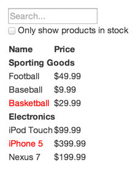

# Thinking in React

React和React-native在编程的思想上是完全一样的，所以要写出好的RN代码，学学React的思想很有必要。本文是学习facebook官方文章[Thinking in React](https://facebook.github.io/react/docs/thinking-in-react.html)的学习记录，包括关键点的翻译和自己的理解。这篇文章大部分是翻译和简化，小部分是自己理解。


### 先看看需求
假设我们需要实现这样一个可过滤的商品列表



而且我们有这样的JSON API
```
[
  {category: "Sporting Goods", price: "$49.99", stocked: true, name: "Football"},
  {category: "Sporting Goods", price: "$9.99", stocked: true, name: "Baseball"},
  {category: "Sporting Goods", price: "$29.99", stocked: false, name: "Basketball"},
  {category: "Electronics", price: "$99.99", stocked: true, name: "iPod Touch"},
  {category: "Electronics", price: "$399.99", stocked: false, name: "iPhone 5"},
  {category: "Electronics", price: "$199.99", stocked: true, name: "Nexus 7"}
];
```

### 将设计稿分解成Component层次

使用矩形线框来确定_Component_和子_Component_。这里要遵循_**单一职责原则**_，一个_Component_只做一件事情。


1. FilterableProductTable－橙色：根节点
2. SearchBar－蓝色：处理用户输入
3. ProductTable－绿色：根据用户输入展现商品列表
4. ProductCategoryRow－蓝绿色：显示分类名称
5. ProductRow－红色：显示单个商品信息

如下为树状结构

FilterableProductTable

> SearchBar

>ProductTable

>>ProductCategoryRow

>>ProductRow


### 完成静态页面

```javascript
var ProductCategoryRow = React.createClass({
  render: function() {
    return (<tr><th colSpan="2">{this.props.category}</th></tr>);
  }
});

var ProductRow = React.createClass({
  render: function() {
    var name = this.props.product.stocked ?
      this.props.product.name :
      <span style={{color: 'red'}}>
        {this.props.product.name}
      </span>;
    return (
      <tr>
        <td>{name}</td>
        <td>{this.props.product.price}</td>
      </tr>
    );
  }
});

var ProductTable = React.createClass({
  render: function() {
    var rows = [];
    var lastCategory = null;
    this.props.products.forEach(function(product) {
      if (product.category !== lastCategory) {
        rows.push(<ProductCategoryRow category={product.category} key={product.category} />);
      }
      rows.push(<ProductRow product={product} key={product.name} />);
      lastCategory = product.category;
    });
    return (
      <table>
        <thead>
          <tr>
            <th>Name</th>
            <th>Price</th>
          </tr>
        </thead>
        <tbody>{rows}</tbody>
      </table>
    );
  }
});

var SearchBar = React.createClass({
  render: function() {
    return (
      <form>
        <input type="text" placeholder="Search..." />
        <p>
          <input type="checkbox" />
          {' '}
          Only show products in stock
        </p>
      </form>
    );
  }
});

var FilterableProductTable = React.createClass({
  render: function() {
    return (
      <div>
        <SearchBar />
        <ProductTable products={this.props.products} />
      </div>
    );
  }
});


var PRODUCTS = [
  {category: 'Sporting Goods', price: '$49.99', stocked: true, name: 'Football'},
  {category: 'Sporting Goods', price: '$9.99', stocked: true, name: 'Baseball'},
  {category: 'Sporting Goods', price: '$29.99', stocked: false, name: 'Basketball'},
  {category: 'Electronics', price: '$99.99', stocked: true, name: 'iPod Touch'},
  {category: 'Electronics', price: '$399.99', stocked: false, name: 'iPhone 5'},
  {category: 'Electronics', price: '$199.99', stocked: true, name: 'Nexus 7'}
];
 
ReactDOM.render(
  <FilterableProductTable products={PRODUCTS} />,
  document.getElementById('container')
);
```

需要注意完成静态页面的时候不要使用_state_，因为_state_都是用于保存用户交互结果的。而且每个组件都只有_render()_方法，根组件_FilterableProductTable_将通过_props_获得数据模型，这种**_单向数据流_**使得React能很好的模块化，响应也很快。
_state_和_props_是React中的两种数据模型，理解两者的区别很重要。简单的理解_props_是外部传递进来的数据，_state_是用户和组件交互时产生的数据。更加详细的说明可以参考[Facebook的另一篇官方文章](https://facebook.github.io/react/docs/interactivity-and-dynamic-uis.html)

### 小而全的state

这个例子中的数据包括

1. 商品列表
2. 用户输入的搜索关键字
3. 复选框的状态
4. 过滤后的商品列表

**判断数据是否为state的标准**

1. 外部传入的不是_state_
2. 不会变化的不是_state_
3. 可以通过其他_state_和_props_计算得到的不是_state_

根据以上原则，是_state_的为

1. 用户输入的搜索关键字
2. 复选框的状态

### state的作用域

```
var ProductCategoryRow = React.createClass({
  render: function() {
    return (<tr><th colSpan="2">{this.props.category}</th></tr>);
  }
});

var ProductRow = React.createClass({
  render: function() {
    var name = this.props.product.stocked ?
      this.props.product.name :
      <span style={{color: 'red'}}>
        {this.props.product.name}
      </span>;
    return (
      <tr>
        <td>{name}</td>
        <td>{this.props.product.price}</td>
      </tr>
    );
  }
});

var ProductTable = React.createClass({
  render: function() {
    var rows = [];
    var lastCategory = null;
    this.props.products.forEach(function(product) {
      if (product.name.indexOf(this.props.filterText) === -1 || (!product.stocked && this.props.inStockOnly)) {
        return;
      }
      if (product.category !== lastCategory) {
        rows.push(<ProductCategoryRow category={product.category} key={product.category} />);
      }
      rows.push(<ProductRow product={product} key={product.name} />);
      lastCategory = product.category;
    }.bind(this));
    return (
      <table>
        <thead>
          <tr>
            <th>Name</th>
            <th>Price</th>
          </tr>
        </thead>
        <tbody>{rows}</tbody>
      </table>
    );
  }
});

var SearchBar = React.createClass({
  render: function() {
    return (
      <form>
        <input type="text" placeholder="Search..." value={this.props.filterText} />
        <p>
          <input type="checkbox" checked={this.props.inStockOnly} />
          {' '}
          Only show products in stock
        </p>
      </form>
    );
  }
});

var FilterableProductTable = React.createClass({
  getInitialState: function() {
    return {
      filterText: '',
      inStockOnly: false
    };
  },

  render: function() {
    return (
      <div>
        <SearchBar
          filterText={this.state.filterText}
          inStockOnly={this.state.inStockOnly}
        />
        <ProductTable
          products={this.props.products}
          filterText={this.state.filterText}
          inStockOnly={this.state.inStockOnly}
        />
      </div>
    );
  }
});


var PRODUCTS = [
  {category: 'Sporting Goods', price: '$49.99', stocked: true, name: 'Football'},
  {category: 'Sporting Goods', price: '$9.99', stocked: true, name: 'Baseball'},
  {category: 'Sporting Goods', price: '$29.99', stocked: false, name: 'Basketball'},
  {category: 'Electronics', price: '$99.99', stocked: true, name: 'iPod Touch'},
  {category: 'Electronics', price: '$399.99', stocked: false, name: 'iPhone 5'},
  {category: 'Electronics', price: '$199.99', stocked: true, name: 'Nexus 7'}
];

ReactDOM.render(
  <FilterableProductTable products={PRODUCTS} />,
  document.getElementById('container')
);
```

确定_state_的作用域就是要确定哪个_Component_应该持有这个_state_，这里有几个步骤。

1. 找到所有_render()_中会用到这个_state_的_Component_
2. 找到一个_Component_包括包含了所有1中的_Component_
3. 2中的_Component_或者它的上级_Component_持有这个_state_
4. 如果你找不到一个有意义的_Component_持有这个_state_，就在这些节点之上创造一个新的_Component_来持有这个_state_

在我们的例子中

1. _ProductTable_需要根据状态来确定显示的列表项目，_SearchBar_也需要状态来显示搜索文本和复选框状态
2. 所以包含两者的公共_Component_是_FilterableProductTable_
3. _FilterableProductTable_持有_state_也是有明确意义的

所以我们在_FilterableProductTable_中持有_state_，然后将_state_作为_props_传递给_ProductTable_和_SearchBar_

### 反向数据流
```
ar ProductCategoryRow = React.createClass({
  render: function() {
    return (<tr><th colSpan="2">{this.props.category}</th></tr>);
  }
});

var ProductRow = React.createClass({
  render: function() {
    var name = this.props.product.stocked ?
      this.props.product.name :
      <span style={{color: 'red'}}>
        {this.props.product.name}
      </span>;
    return (
      <tr>
        <td>{name}</td>
        <td>{this.props.product.price}</td>
      </tr>
    );
  }
});

var ProductTable = React.createClass({
  render: function() {
    var rows = [];
    var lastCategory = null;
    this.props.products.forEach(function(product) {
      if (product.name.indexOf(this.props.filterText) === -1 || (!product.stocked && this.props.inStockOnly)) {
        return;
      }
      if (product.category !== lastCategory) {
        rows.push(<ProductCategoryRow category={product.category} key={product.category} />);
      }
      rows.push(<ProductRow product={product} key={product.name} />);
      lastCategory = product.category;
    }.bind(this));
    return (
      <table>
        <thead>
          <tr>
            <th>Name</th>
            <th>Price</th>
          </tr>
        </thead>
        <tbody>{rows}</tbody>
      </table>
    );
  }
});

var SearchBar = React.createClass({
  handleChange: function() {
    this.props.onUserInput(
      this.refs.filterTextInput.value,
      this.refs.inStockOnlyInput.checked
    );
  },
  render: function() {
    return (
      <form>
        <input
          type="text"
          placeholder="Search..."
          value={this.props.filterText}
          ref="filterTextInput"
          onChange={this.handleChange}
        />
        <p>
          <input
            type="checkbox"
            checked={this.props.inStockOnly}
            ref="inStockOnlyInput"
            onChange={this.handleChange}
          />
          {' '}
          Only show products in stock
        </p>
      </form>
    );
  }
});

var FilterableProductTable = React.createClass({
  getInitialState: function() {
    return {
      filterText: '',
      inStockOnly: false
    };
  },

  handleUserInput: function(filterText, inStockOnly) {
    this.setState({
      filterText: filterText,
      inStockOnly: inStockOnly
    });
  },

  render: function() {
    return (
      <div>
        <SearchBar
          filterText={this.state.filterText}
          inStockOnly={this.state.inStockOnly}
          onUserInput={this.handleUserInput}
        />
        <ProductTable
          products={this.props.products}
          filterText={this.state.filterText}
          inStockOnly={this.state.inStockOnly}
        />
      </div>
    );
  }
});


var PRODUCTS = [
  {category: 'Sporting Goods', price: '$49.99', stocked: true, name: 'Football'},
  {category: 'Sporting Goods', price: '$9.99', stocked: true, name: 'Baseball'},
  {category: 'Sporting Goods', price: '$29.99', stocked: false, name: 'Basketball'},
  {category: 'Electronics', price: '$99.99', stocked: true, name: 'iPod Touch'},
  {category: 'Electronics', price: '$399.99', stocked: false, name: 'iPhone 5'},
  {category: 'Electronics', price: '$199.99', stocked: true, name: 'Nexus 7'}
];

ReactDOM.render(
  <FilterableProductTable products={PRODUCTS} />,
  document.getElementById('container')
);
```
这一部分在原文中稍微有些复杂。简而言之：_state_在_FilterableProductTable_中，但是真正的交互发生在_SearchBar_的字元素中，所以需要从子向父传递信息。这里主要是通过回调机制实现的。

1. 由_FilterableProductTable_通过_props.onUserInput_传一个回调函数_handleUserInput_给_SearchBar_。
2. 在文本或者复选状态发生变化时，通过_onChange_指定调用_SearchBar_的_handleChange_
3. _handleChange_通过_refs_获取文本和复选框状态，并执行回调函数。_refs_的机制文中并没有详述。
4. _handleUserInput_中改变_state_，并更新页面