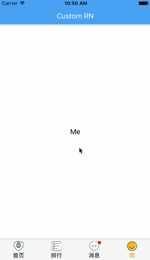
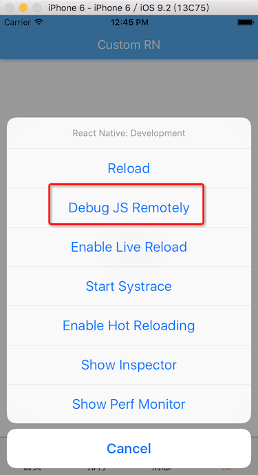
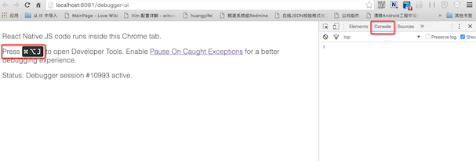
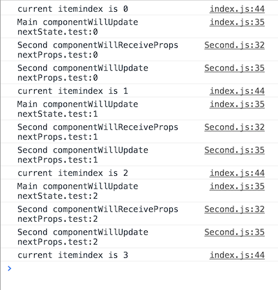

#Android和iOS通用的Tab react-native-xtabbar

这里介绍了使用开源项目react-native-xtabbar。包括如何通过npm引入第三方工程，props和state的使用，以及调试React Native代码。

[源码地址](http://git.oschina.net/idiotwind/LearnRN/tree/9b2af55c3a2751ee053c16ab96c965927ec4de19/)

演示效果



这个项目最重要的一点就是Android和iOS通用。

1. 通过tab的内容点击跳转的Second页面
2. 切换tab时，tab内容的变化
3. 切换tab时，消息上的小红点或数字提醒变化

### 使用react-native-xtabbar
React Native的依赖包时通过npm管理的，关于npm的详细介绍可以参考 [npm介绍](http://www.tuicool.com/articles/VB7nYn)

我们这里启动命令行，并在工程根目录下执行以下命令

```
npm install 'react-native-xtabbar' --save
```

执行完成后，就可以在源码中使用react-native-xtabbar了。以下为主要代码片段

```javascript
import TabBar from 'react-native-xtabbar';
import Second from '../Second.js';
export default class Main extends React.Component {

    constructor(props) {
        super(props);
        this.state = {
            badge: ' ',
        };
    }

    _pressButton() {
        this.props.navigator.push({
            title: 'Second',
            component: Second
        })
    }

    render() {
            return(
                <View style={styles.container}>
                    <TabBar
                    defaultPage={3}
                    style={styles.content}
                    onItemSelected={(index) => {console.log('current itemindex is ${index}');}}>
                        <TabBar.Item
                            icon={require('./img/home_normal.png')}
                            selectedIcon={require('./img/home_selected.png')}
                            onPress={() => {
                                this.setState({badge: ' ',});
                            }}
                            title='首页'>
                            <View style={styles.text}>
                              <Text style={{fontSize: 18}}>Home</Text>
                            </View>
                        </TabBar.Item>

                        <TabBar.Item
                            icon={require('./img/rank_normal.png')}
                            selectedIcon={require('./img/rank_selected.png')}
                            onPress={() => {
                                this.setState({badge: 5,});
                            }}
                            title='排行'>
                            <View style={styles.text}>
                              <Text style={{fontSize: 18}}>Rank</Text>
                            </View>
                        </TabBar.Item>

                        <TabBar.Item
                            icon={require('./img/message_normal.png')}
                            selectedIcon={require('./img/message_selected.png')}
                            badge={this.state.badge}
                            onPress={() => {
                                this.setState({badge: '',});
                            }}
                            title='消息'>
                            <View style={styles.text}>
                              <Text style={{fontSize: 18}}>Message</Text>
                            </View>
                        </TabBar.Item>

                        <TabBar.Item
                            icon={require('./img/profile_normal.png')}
                            selectedIcon={require('./img/profile_selected.png')}
                            title='我'>
                              <View style={styles.text}>
                                <TouchableOpacity onPress={this._pressButton.bind(this)}>
                                  <Text style={{fontSize: 18}}>Me</Text>
                                </TouchableOpacity>
                              </View>
                        </TabBar.Item>
                    </TabBar>
                </View>
            );
    }
}
```


- TabBar的使用，主要通过TabBar包含TabBar.Item实现
- TabBar中用到的props有，defaultPage（默认显示哪个Item），onItemSelected（Item被选中时的回调函数）
- TabBar.Item中用到的props有，icon（正常状态下的图标），selectedIcon（选中状态下的图标），onPress（Item被点击时的回调函数，和TabBar的回调），title（Item上显示的文字），badge（tab上的红点或数字，这里只有message tab上定义了）

###通过调试回顾state、props和component生命周期

这里的红点是随着用户交互变化的，所以将其设置为state。state会在前三个tab点击的时候通过调用this.setState触发变化，调用之后页面会自动变化。页面的变化又会触发Component的生命周期componentWillReceiveProps。下面我们对代码稍作修改，并介绍如何调试React Native代码。

修改的代码有以下四点，具体的修改可参考[Commit 30fa42](http://git.oschina.net/idiotwind/LearnRN/tree/30fa42e5bf7e5cb014795bd7d92bc964a1ead66e/)

- 将第四个tab的内容改为独立的Component——Second
- 给Main增加一个状态test，并将该状态作为props传递给Second
- 给Main和Second分别增加两个生命周期函数componentWillReceiveProps和componentWillUpdate并打印日志
- tab切换时修改修改状态test


```javascript
// Main/index.js
    componentWillReceiveProps(nextProps) {
      console.log('Main componentWillReceiveProps nextProps.test:' + nextProps.test);
    }

    componentWillUpdate(nextProps, nextState) {
      console.log('Main componentWillUpdate nextState.test:' + nextState.test);
    }

    render(){
            return(
                   <View ....
                      ....
                        <TabBar.Item
                            icon={require('./img/profile_normal.png')}
                            selectedIcon={require('./img/profile_selected.png')}
                            title='我'>
                              <View style={styles.text}>
                                  <Second test={this.state.test} />
                              </View>
                        </TabBar.Item>
                    </TabBar>
                </View>
            );
    }
}

// Second.js
    componentWillReceiveProps(nextProps) {
      console.log('Second componentWillReceiveProps nextProps.test:' + nextProps.test);
    }
    componentWillUpdate(nextProps, nextState) {
      console.log('Second componentWillUpdate nextProps.test:' + nextProps.test);
    }
```

在Mac上通过command＋D并选择Debug JS Remotely开启调试模式



系统会自动在Chrome中打开调试页面，在右侧的Console中就可以看到我们打印的日志



依次点击4个tab，可以在console区域看到如下log。前三次点击的调用次序都为

- Main componentWillUpdate，nextState为setState中设置的状态，nextProps无效
- Second componentWillReceiveProps，nextProps.test为在Main中使用Second是传递的参数test
- Second componentWillUpdate，这里的nextProps有效，而nextState没有变化

通过这个例子可以直观的看到单向的信息流是怎么通过Component的生命周期引起界面变化的。如果Second中的props.test和界面的显示有关，则会自动刷新到界面上。



### 补充信息
react-native-xtabbar的最新代码目前还没有发布到npm上，所以TabBar的隐藏，通过代码调用切换Tab等功能还无法使用。

如果需要使用这些功能，可以用项目在[github](http://github.com/sincethere/react-native-tabbar)的源码覆盖本地node_modules中对应的文件。